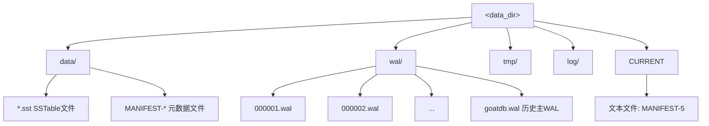
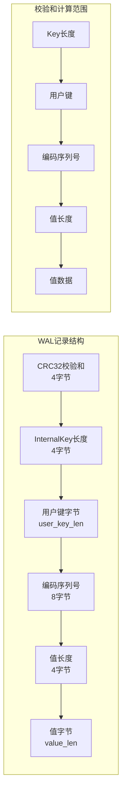
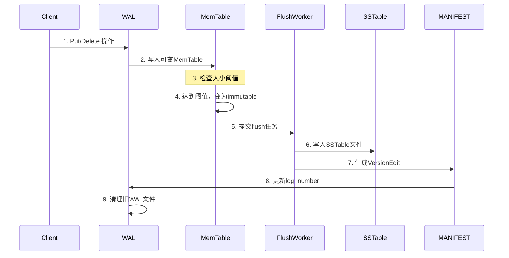
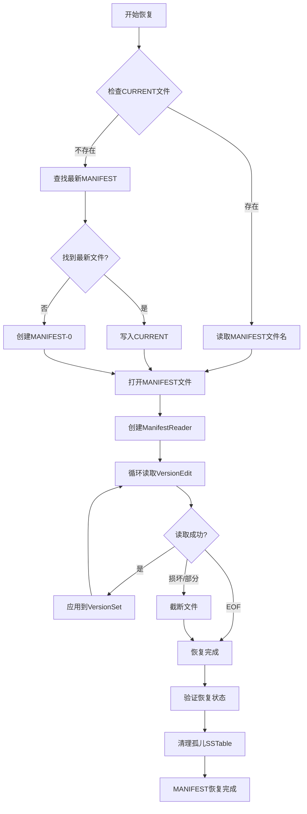
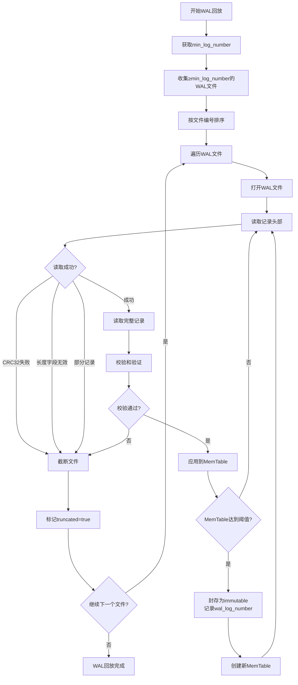
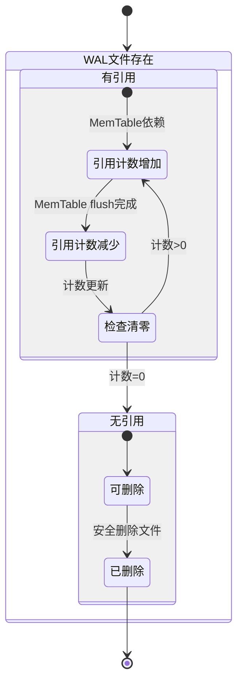
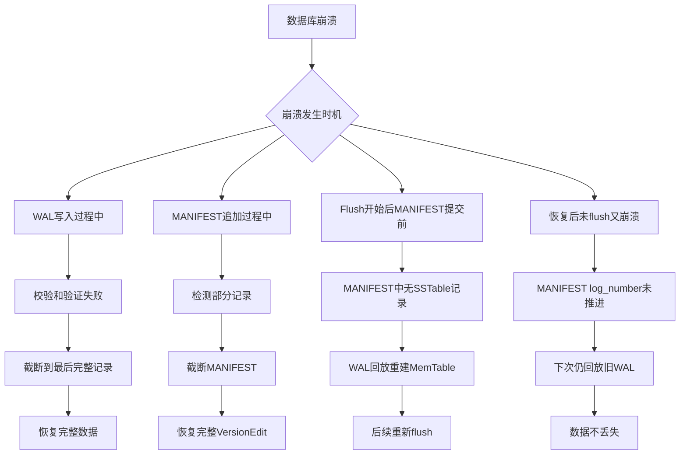

# GoatDB 崩溃恢复机制详解（WAL + MANIFEST）

本文档详细说明 GoatDB 当前实现的崩溃恢复原理与流程，基于对代码的全面分析。恢复机制结合 Write-Ahead Log (WAL) 和 MANIFEST 文件确保数据持久性和一致性。

## 1. 概述

GoatDB 采用 LSM-Tree (Log-Structured Merge-Tree) 架构，其崩溃恢复机制基于两个核心组件：
- **WAL (Write-Ahead Log)**：记录所有数据修改操作，确保操作的原子性和持久性
- **MANIFEST**：记录 SSTable 文件的元数据变更，维护存储引擎的全局状态

恢复过程能够在数据库异常崩溃后，将数据恢复到一致的状态，最大程度减少数据丢失。

## 2. 磁盘组件与目录结构

由 `DbPathManager` 管理的目录布局如下：



**关键文件说明：**
- **WAL (Write-Ahead Log)**：记录所有 Put/Delete 操作，用于崩溃后恢复未持久化的数据
- **MANIFEST**：`VersionEdit` 的追加日志，记录 SSTable 集合的元数据变更
- **CURRENT**：文本文件，包含当前使用的 MANIFEST 文件名（如 `MANIFEST-5`）

## 3. WAL 记录格式

每条 WAL 记录按以下顺序存储：



**字段说明：**
1. **CRC32 校验和** (u32, little-endian)：覆盖除自身外的所有字段
2. **InternalKey 总长度** (u32, little-endian)：用户键长度 + 8字节序列号
3. **用户键字节**：原始用户键数据
4. **编码后的序列号** (u64, little-endian)：低8位为操作类型（Put/Delete/Tombstone）
5. **值长度** (u32, little-endian)
6. **值字节**：原始值数据

**校验和计算**：使用 CRC32 算法计算 `key_len + user_key + encoded_sequence + value_len + value`。

## 4. 正常写入路径（稳态操作）



**详细步骤：**
1. **客户端写入**：发起 Put/Delete 操作
2. **WAL 记录**：先写入 WAL 文件（`wal_sync` 选项控制是否立即 fsync）
3. **MemTable 更新**：写入可变 MemTable（线程安全的 SkipList）
4. **MemTable 切换**：当 MemTable 达到 `mem_table_size` 阈值时：
   - 当前 MemTable 标记为 immutable
   - 创建新的可变 MemTable
   - 提交后台 flush 任务
5. **SSTable 生成**：后台 `FlushWorker` 将 immutable MemTable 写入 SSTable 文件
6. **MANIFEST 更新**：SSTable 写入完成后生成 `VersionEdit` 并追加到 MANIFEST
7. **WAL 清理**：依赖该 WAL 的所有 MemTable 都 flush 完成后，WAL 文件可安全删除

## 5. 恢复入口点

恢复在 `KvEngine::new_with_options()` 中执行，当 `options.recover_from_wal = true` 时触发。

```rust
pub fn new_with_options(options: KvEngineOptions) -> Result<Self, std::io::Error> {
    // 1. 初始化路径管理器
    let _ = DbPathManager::try_init(&options.data_dir)?;
    
    // 2. 创建LSMState（内部调用VersionSet::open()恢复MANIFEST）
    let lsm_state = Arc::new(RwLock::new(LSMState::new(...)?));
    
    // 3. 获取min_log_number（已持久化的WAL边界）
    let min_log_number = {
        let guard = lsm_state.read().unwrap();
        let vs_guard = guard.version_set.read().unwrap();
        vs_guard.log_number()
    };
    
    // 4. 回放WAL
    let (wal_stats, wal_max_number) = if options.recover_from_wal {
        Self::replay_into_state(&lsm_state, options.mem_table_size, min_log_number)?
    } else { ... };
    
    // 5. 选择新的WAL编号（不推进MANIFEST log_number）
    let current_log_number = {
        let guard = lsm_state.read().unwrap();
        let vs_guard = guard.version_set.read().unwrap();
        let mut log_number = vs_guard.log_number();
        if log_number == 0 { log_number = 1; }
        if wal_max_number >= log_number { log_number = wal_max_number + 1; }
        log_number
    };
    
    // 6. 提交恢复阶段遗留的immutable memtables给FlushWorker
    // ...
}
```

## 6. MANIFEST 恢复细节

### 6.1 恢复流程



### 6.2 MANIFEST 记录格式

每条 MANIFEST 记录包含：
- 长度前缀 (8 bytes, big-endian)
- `VersionEdit` 编码数据

`VersionEdit` 使用 tag-value 编码，支持以下字段：

| Tag | 字段 | 说明 |
|-----|------|------|
| 1 | `comparator_name` | 比较器名称（兼容性检查） |
| 2 | `log_number` | 当前有效的WAL日志编号 |
| 3 | `next_file_number` | 下一个可用文件编号 |
| 4 | `last_sequence` | 全局最大序列号 |
| 5 | `compact_pointers` | 各级压缩指针 |
| 6 | `deleted_files` | 要删除的文件 (level, file_id) |
| 7 | `new_files` | 新增文件 (level, file_metadata) |

### 6.3 完整性验证

`validate_recovery()` 执行以下检查：

1. **文件存在性**：MANIFEST 中记录的所有 SSTable 文件必须存在
2. **大小一致性**：SSTable 实际大小不小于 MANIFEST 记录的大小
3. **格式有效性**：SSTable 文件可正常打开（验证 footer/index/bloom 结构）
4. **层级约束**：
   - Level 0：文件可重叠（来自不同 flush）
   - Level 1+：文件键范围必须非重叠
5. **序列号单调性**：`last_sequence` 不小于当前版本创建序列号
6. **孤儿文件清理**：删除未被 MANIFEST 引用的 SSTable 文件

## 7. WAL 回放细节

### 7.1 回放流程



### 7.2 关键处理逻辑

1. **WAL 文件收集**：`list_wal_files(min_log_number)`
   - 扫描 `wal/` 目录，收集所有 `.wal` 文件
   - 按文件编号排序（文件名即 log_number）
   - 如果 `min_log_number == 0`，包含历史主 WAL `goatdb.wal`
   - 只保留编号 ≥ `min_log_number` 的 WAL 文件

2. **损坏处理**：
   - **校验和失败**：截断文件到最后一条有效记录
   - **长度字段无效**（key_len < 8）：截断文件
   - **部分记录**：遇到 UnexpectedEof 时截断文件

3. **MemTable 管理**：
   - 将记录写入当前可变 MemTable
   - 当 MemTable 达到大小时，封存为 immutable MemTable
   - 记录该 immutable MemTable 对应的 WAL 编号 (`wal_log_number`)

## 8. 新 WAL 编号选择策略

恢复后选择新 WAL 编号的关键原则：**不推进 MANIFEST 中的 log_number**。

```mermaid
flowchart TD
    A[开始选择新WAL编号] --> B[获取MANIFEST log_number]
    B --> C{log_number == 0?}
    C -->|是| D[设置为1]
    C -->|否| E[保持原值]
    D --> F
    E --> F
    
    F[获取回放的max_wal_number] --> G{max_wal_number ≥ log_number?}
    G -->|是| H[log_number = max_wal_number + 1]
    G -->|否| I[保持log_number]
    H --> J[新WAL编号确定]
    I --> J
    
    subgraph "设计原理"
        K[MANIFEST log_number] --> L[表示已持久化数据的WAL边界]
        M[恢复时推进log_number] --> N[可能导致"恢复后未flush又崩溃"的数据丢失]
        O[正确推进时机] --> P[成功flush并提交MANIFEST后]
    end
```

**算法说明：**
```rust
let current_log_number = {
    let guard = lsm_state.read().unwrap();
    let vs_guard = guard.version_set.read().unwrap();
    let mut log_number = vs_guard.log_number();  // MANIFEST 中的 log_number
    if log_number == 0 { log_number = 1; }       // 处理历史主 WAL
    if wal_max_number >= log_number {
        log_number = wal_max_number + 1;         // 跳过已存在的 WAL 文件
    }
    log_number
};
```

## 9. WAL 引用计数与清理机制



**实现机制：**
1. **引用计数表**：`wal_refcounts: Arc<Mutex<HashMap<u64, usize>>>`
2. **增加引用**：恢复时为每个 immutable MemTable 增加对应 WAL 的引用计数
3. **减少引用**：FlushWorker 完成时减少引用计数
4. **清理条件**：当某个 WAL 的引用计数归零时，安全删除该文件

## 10. 覆盖的崩溃场景

### 10.1 WAL 写入过程中崩溃
- **场景**：写入 WAL 记录时发生崩溃，记录可能不完整
- **处理**：恢复时校验和失败或遇到部分记录，截断到最后一条完整记录
- **保证**：之前完整写入的记录可恢复，部分写入的记录被丢弃

### 10.2 MANIFEST 追加过程中崩溃
- **场景**：追加 `VersionEdit` 到 MANIFEST 时崩溃
- **处理**：恢复时 `ManifestReader` 检测到部分记录并截断
- **保证**：之前完整的 `VersionEdit` 可恢复，部分写入的编辑被丢弃

### 10.3 Flush 已开始但 MANIFEST 未提交
- **场景**：SSTable 已写入磁盘，但对应的 `VersionEdit` 尚未写入 MANIFEST
- **处理**：恢复时 MANIFEST 中无该 SSTable 记录，但 WAL 包含相应数据
- **保证**：WAL 回放会重建 MemTable，后续 flush 会重新生成 SSTable

### 10.4 恢复后尚未 Flush 又再次崩溃
- **场景**：恢复过程完成，但 immutable MemTable 尚未 flush 时再次崩溃
- **处理**：由于恢复时未推进 MANIFEST `log_number`，下次启动仍会回放旧 WAL
- **保证**：数据不会丢失，但可能产生冗余的 L0 SSTable（后续 compaction 清理）



## 11. 一致性与耐久性

### 11.1 持久化级别配置

| 配置选项 | 默认值 | 说明 | 崩溃保证 |
|---------|--------|------|----------|
| `wal_sync` | `false` | 是否每次写入后执行 fsync | `true`: 强持久性<br/>`false`: 依赖OS刷新 |
| `recover_from_wal` | `true` | 启动时是否尝试恢复 | `true`: 启用恢复机制 |

### 11.2 原子性保证
- **WAL 记录**：校验和确保记录完整性，部分写入可检测并修复
- **MANIFEST 更新**：长度前缀 + 完整记录，尾部截断保持一致性
- **SSTable 文件**：构建完成后原子性重命名（通过临时文件）

### 11.3 数据完整性检查
- **交叉验证**：MANIFEST 恢复时验证 SSTable 文件存在性、大小和格式
- **层级约束**：Level 1+ 文件必须非重叠，Level 0 文件可重叠
- **序列号单调性**：全局序列号只增不减，确保操作顺序

## 12. 当前实现限制

### 12.1 已知限制
1. **内存使用无硬上限**：损坏的 WAL/MANIFEST 文件可能导致 OOM（缺少最大长度检查）
2. **Level 0 读取顺序**：未明确优先最新文件，可能影响读取正确性
3. **压缩指针未持久化**：`compact_pointers` 字段在当前实现中未使用
4. **恢复性能**：回放大量 WAL 记录时可能较慢，缺少批量优化

### 12.2 可改进方向
1. **明确 WAL 边界**：持久化 `min_log_number` / `prev_log_number` 减少恢复范围
2. **增量恢复**：支持从检查点恢复，避免全量回放
3. **并行回放**：多个 WAL 文件可并行回放（需要保证顺序）
4. **恢复进度报告**：提供恢复进度估计和统计信息
5. **损坏文件隔离**：将损坏的 WAL/MANIFEST 文件移动到隔离目录供诊断

## 13. 测试覆盖

基于 `tests/recovery_tests.rs`，当前测试覆盖以下边界情况：

| 测试用例 | 验证内容 |
|----------|----------|
| `recovery_handles_truncated_wal_tail` | WAL 尾部截断恢复 |
| `recovery_replays_multiple_wals_in_order` | 多 WAL 文件顺序回放 |
| `recovery_advances_log_number_past_existing_wals` | 新 WAL 编号正确选择 |
| `recovery_truncates_manifest_tail` | MANIFEST 尾部截断 |
| `recovery_errors_on_corrupted_manifest_edit` | 损坏 MANIFEST 记录的错误处理 |
| `recovery_replays_wal_if_flush_never_completed` | "恢复后未 flush 又崩溃"场景的数据安全性 |

## 14. 总结

GoatDB 的崩溃恢复机制通过 WAL + MANIFEST 双日志设计，提供了稳健的数据持久性保证。核心设计原则包括：

1. **写前日志优先**：所有数据修改先记录到 WAL，再更新内存状态
2. **状态增量记录**：MANIFEST 记录 SSTable 集合的增量变更
3. **安全边界管理**：WAL 编号只在数据持久化后推进，避免数据丢失窗口
4. **损坏容忍**：尾部截断机制容忍部分写入，最大化数据恢复
5. **引用计数清理**：WAL 文件在无依赖后安全删除，避免过早清理

该实现已在测试中验证了多种崩溃场景的恢复能力，为上层应用提供了可靠的持久化存储基础。通过合理的配置和持续的优化，可以满足不同场景下的数据持久性需求。

---

**相关源码文件：**
- `src/goatkv/core/kv_engine.rs` - 恢复入口点
- `src/goatkv/storage/wal_manager.rs` - WAL 管理与回放
- `src/goatkv/metadata/version_set.rs` - MANIFEST 恢复
- `src/goatkv/metadata/manifest.rs` - MANIFEST 读写器
- `src/goatkv/core/flush_worker.rs` - 后台 flush 与 WAL 清理
