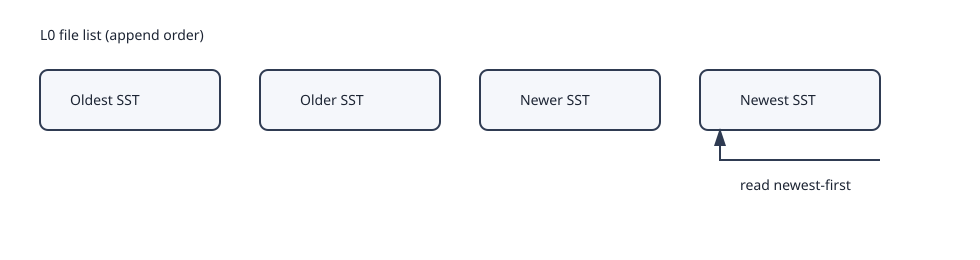
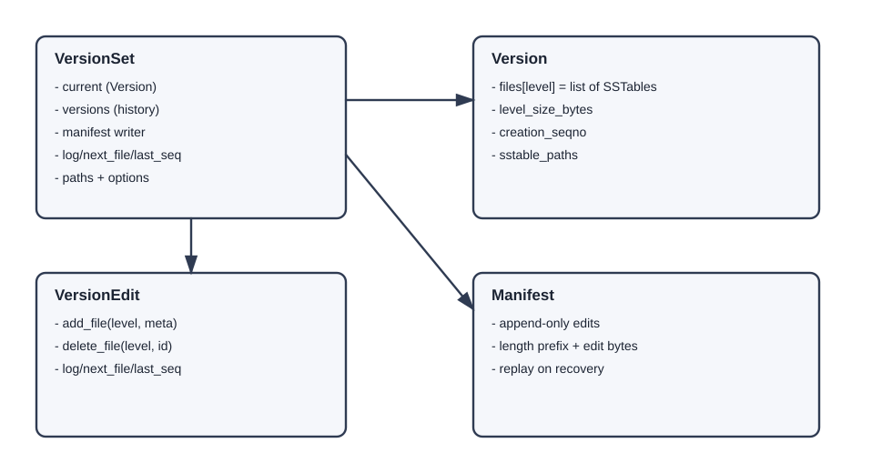
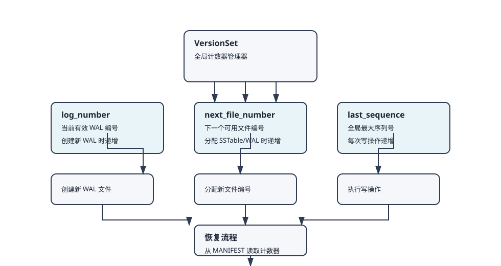
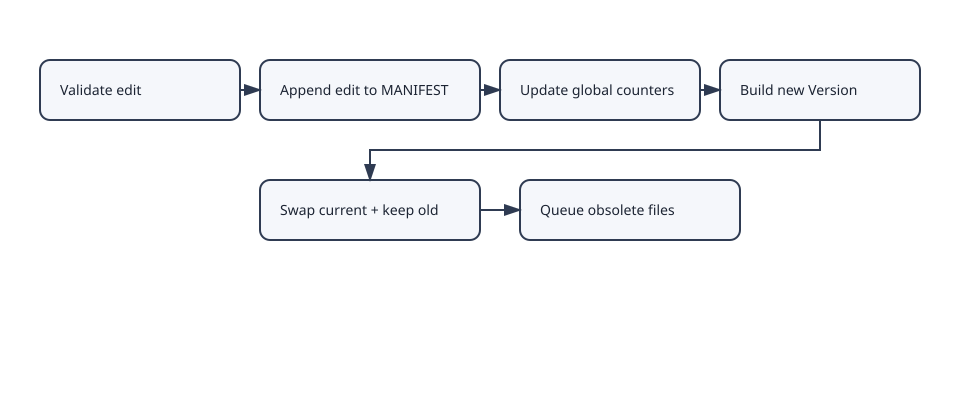
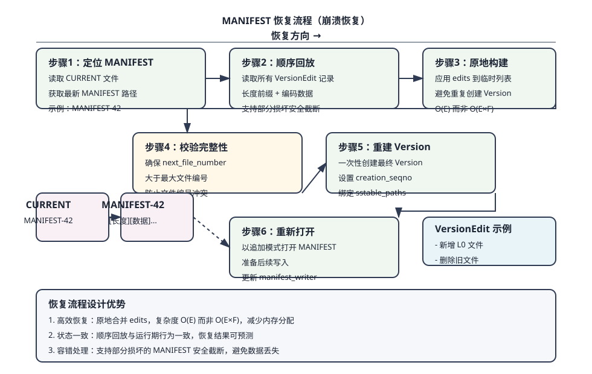
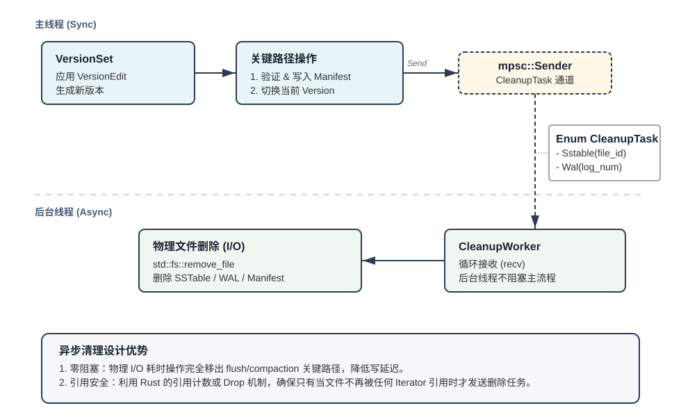
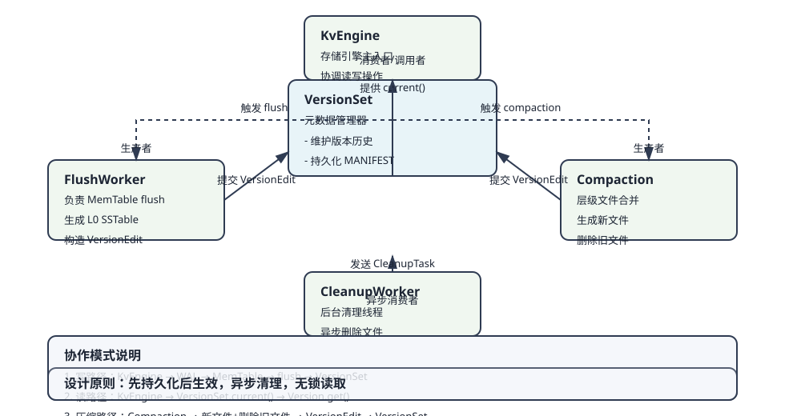

# VersionSet 设计方案

## 概述

VersionSet 是 GoatDB 的核心元数据管理器，担任数据库的“真相来源”（Single Source of Truth）。它负责将 Flush 和 Compaction 操作产生的增量变更（VersionEdit）应用为新的不可变快照（Version），并通过 MANIFEST 日志持久化这些变更，确保崩溃恢复后状态一致性。

本设计文档采用“结构图 + 流程图 + 关键不变量”的方式阐述实现原理，避免直接引用代码，聚焦于架构设计和决策理由。

## 核心组件与职责

### Version（版本快照）
- **不可变快照**：一旦创建永不修改，包含某一时刻数据库的完整元数据视图
- **层级化文件列表**：存储每层 SSTable 的文件元数据（`files[level]`）
- **层级大小统计**：记录每层 SSTable 的总字节数（`level_size_bytes`）
- **创建序列号**：绑定到该版本的最新全局序列号（`creation_seqno`）
- **路径管理器**：引用 `SstablePaths` 用于定位物理文件

### VersionSet（版本集合）
- **版本生命周期管理**：维护当前版本（`current`）和历史版本队列（`versions`）
- **MANIFEST 持久化**：负责 VersionEdit 的追加写入与同步
- **全局计数器推进**：管理 `log_number`、`next_file_number`、`last_sequence`
- **元数据验证**：确保 VersionEdit 的合法性（文件存在性、层级合法性等）
- **清理任务分发**：通过 `CleanupTask` 异步删除不再需要的文件

### VersionEdit（版本编辑）
- **增量变更描述**：仅记录“新增文件”、“删除文件”、“更新全局计数器”等操作
- **序列化能力**：支持编码/解码，用于 MANIFEST 持久化
- **轻量级结构**：不包含完整文件数据，只存储必要元数据

### Manifest（元数据日志）
- **追加写入**：采用 WAL（Write-Ahead Log）模式，先持久化再更新内存
- **崩溃恢复**：通过顺序回放 VersionEdit 重建数据库状态
- **长度前缀格式**：每条记录为 `[8字节长度] + [VersionEdit编码字节]`

### CleanupTask（清理任务）
- **异步文件删除**：解耦物理删除与版本切换，避免阻塞关键路径
- **类型化任务**：支持 `Sstable(u64)` 和 `Wal(u64)` 两种清理目标
- **后台执行**：由专门的 `CleanupWorker` 线程处理

## 关键不变量

### 1. L0 vs L1+ 文件组织策略
- **L0 允许重叠**：MemTable flush 产生的 SSTable 可能键范围重叠
- **L1+ 严格有序**：Compaction 后文件按键排序且互不重叠
- **读取顺序优化**：L0 采用逆序遍历（新→旧），保证读到最新值

### 2. Version 不可变性
- **创建后不修改**：任何元数据变更都通过创建新 Version 实现
- **并发读友好**：读路径持 `Arc<Version>`，无需锁保护
- **历史版本保留**：旧 Version 暂存于队列，支持延迟清理

### 3. MANIFEST 追加写
- **先持久化后更新**：VersionEdit 必须写入 MANIFEST 并同步后才更新内存
- **顺序回放保证**：崩溃后可通过重放 MANIFEST 恢复一致状态
- **长度前缀记录**：支持部分损坏时的安全截断

## VersionSet 内部结构

### 核心字段说明
| 字段名 | 类型 | 描述 |
|--------|------|------|
| `current` | `Arc<Version>` | 当前活动版本，读路径直接引用 |
| `versions` | `VecDeque<Arc<Version>>` | 历史版本队列（大小受 `max_versions` 限制） |
| `manifest_writer` | `Option<ManifestWriter>` | MANIFEST 文件写入器 |
| `manifest_file_number` | `u64` | 当前 MANIFEST 文件编号 |
| `log_number` | `u64` | 当前有效 WAL 日志编号 |
| `next_file_number` | `u64` | 下一个可分配的文件编号 |
| `last_sequence` | `u64` | 全局最大序列号（用于 MVCC） |
| `obsolete_sender` | `Sender<CleanupTask>` | 清理任务发送通道 |
| `options` | `VersionSetOptions` | 配置参数 |

## 全局计数器管理

### 1. Log Number（日志编号）
- **作用**：标识当前有效的 WAL 日志文件
- **更新时机**：创建新 WAL 文件时递增
- **恢复保证**：崩溃后重放所有 `log_number` 之后的 WAL

### 2. Next File Number（下一个文件编号）
- **作用**：分配唯一 SSTable/WAL 文件编号
- **分配策略**：严格递增，永不重复
- **恢复校验**：重启时确保大于磁盘上最大文件编号

### 3. Last Sequence（最后序列号）
- **作用**：全局 MVCC 版本控制
- **单调递增**：每次写操作递增
- **版本绑定**：每个 Version 记录创建时的 `last_sequence`

## 配置选项（VersionSetOptions）

| 配置项 | 类型 | 默认值 | 描述 |
|--------|------|--------|------|
| `max_versions` | `usize` | 10 | 保留的历史版本数量，避免内存无限增长 |
| `manifest_max_size` | `u64` | 64MB | MANIFEST 文件大小限制，超过触发重写 |
| `manifest_rewrite_edit_count` | `usize` | 1000 | 触发 MANIFEST 重写的版本编辑数量阈值 |
| `num_levels` | `usize` | 7 | LSM 树层级数量，决定文件组织深度 |

## 全局计数器管理流程图

上图展示了 VersionSet 中三个全局计数器的管理机制：

1. **log_number**：标识当前有效 WAL 日志文件，创建新 WAL 时递增
2. **next_file_number**：分配唯一 SSTable/WAL 文件编号，分配文件时递增
3. **last_sequence**：全局 MVCC 版本控制，每次写操作递增

计数器更新遵循"先持久化后生效"原则：VersionEdit 写入 MANIFEST 后，计数器才在内存中更新。恢复流程从 MANIFEST 读取计数器值，确保崩溃后状态一致。

## VersionEdit 应用流程

### 步骤详解

1. **合法性验证**（`validate_edit`）
   - 检查删除文件是否存在
   - 验证新增文件层级合法性
   - 防止重复文件或非法操作

2. **MANIFEST 持久化**（`append_edit + sync`）
   - 编码 VersionEdit 并写入 MANIFEST
   - 执行 `fsync` 确保数据落盘
   - **设计理由**：遵循 WAL 原则，先持久化再更新内存

3. **全局计数器更新**
   - 原子更新 `log_number`、`next_file_number`、`last_sequence`
   - **设计理由**：保持计数器与 edit 变更原子一致

4. **创建新 Version**（`create_new_version`）
   - 复制当前版本文件列表（Copy-on-Write）
   - 应用删除/新增文件操作
   - 对 L1+ 文件重新排序（确保有序性）
   - **设计理由**：通过 Arc 共享元数据，避免深层复制

5. **版本切换**（原子替换）
   - 将旧 Version 移入历史队列
   - 设置新 Version 为 `current`
   - **设计理由**：瞬间切换，读路径无感知

6. **异步清理**（发送 CleanupTask）
   - 将被删除文件加入清理队列
   - **设计理由**：延迟物理删除，避免阻塞读路径

## 读路径如何使用 Version

读操作通过 `VersionSet::current()` 获取最新快照后，按以下顺序查找数据：

| 步骤 | 查找位置 | 策略 | 设计理由 |
|------|----------|------|----------|
| 1 | MemTable | 直接查找哈希表 | 内存最快，包含最新数据 |
| 2 | ImmutableMemTable | 只读内存表查找 | 等待 flush 的已提交数据 |
| 3 | L0 SSTables | 逆序遍历（新→旧） | L0 文件可能重叠，新文件包含更新数据 |
| 4 | L1+ SSTables | 二分查找 | 文件有序不重叠，快速定位 |
| 5 | 未找到 | 返回 KeyNotFound | 键不存在于数据库中 |

上图展示了读路径的完整查找流程，采用多级查找策略：
- **内存优先**：先检查 MemTable 和 ImmutableMemTable，内存访问最快
- **L0逆序**：由于L0文件可能重叠，逆序遍历确保读到最新值
- **L1+二分**：利用高层级文件有序性，二分查找提高效率
- **无锁读取**：持有 `Arc<Version>` 快照，无需同步开销

**查找流程说明**：
1. 首先检查内存中的可变 MemTable，这是最快的访问路径
2. 如果未找到，检查不可变 MemTable（等待写入磁盘的数据）
3. 接着逆序遍历 L0 层 SSTable 文件，由于 L0 文件可能键范围重叠，必须从最新文件开始查找
4. 对于 L1 及更高层级的文件，利用其有序不重叠的特性进行二分查找
5. 如果所有层级都未找到，则确认键不存在

此策略确保在 L0 文件重叠时优先返回最新值，同时利用高层级文件的有序性提高查找效率。

## 恢复流程（MANIFEST 回放）

上图详细展示了崩溃恢复时 MANIFEST 文件的完整处理流程，共分为六个关键步骤：

### 恢复步骤
1. **定位 MANIFEST**：读取 `CURRENT` 文件获取最新 MANIFEST 路径
2. **顺序回放**：读取所有 VersionEdit 记录
3. **原地构建**：应用 edits 到临时文件列表（避免重复创建 Version）
4. **校验完整性**：确保 `next_file_number` 大于最大文件编号
5. **重建 Version**：一次性创建最终 Version
6. **重新打开**：以追加模式打开 MANIFEST 准备后续写入

### 设计优势
- **高效恢复**：原地合并 edits，O(E) 复杂度而非 O(E×F)
- **状态一致**：回放结果与崩溃前状态完全一致
- **容错处理**：支持部分损坏的 MANIFEST 安全截断

## 文件清理机制

上图展示了异步文件清理的设计架构：

- **同步关键路径**：VersionEdit 验证、MANIFEST 写入、版本切换等关键操作同步执行
- **异步清理路径**：物理文件删除通过 CleanupTask 通道交由后台 CleanupWorker 处理
- **通道通信**：使用 mpsc（多生产者单消费者）通道传递 CleanupTask
- **类型化任务**：支持 `Sstable(file_id: u64)` 和 `Wal(log_number: u64)` 两种清理目标

### 清理策略
- **异步执行**：通过 `CleanupWorker` 后台线程处理
- **延迟删除**：旧 Version 可能仍被读路径引用，需等待释放
- **类型化任务**：区分 SSTable 和 WAL 文件清理

### 清理时机
| 文件类型 | 清理触发条件 | 清理保证 |
|----------|--------------|----------|
| SSTable | Compaction 后旧文件不再被任何 Version 引用 | 确保无读操作引用被删文件 |
| WAL | MemTable 成功 flush 后对应的 WAL 可安全删除 | 数据已持久化到 SSTable |
| MANIFEST | 旧 MANIFEST 文件在重写后删除 | 新 MANIFEST 包含完整历史 |

### 设计理由
- **避免阻塞**：物理 I/O 不阻塞 flush/compaction 关键路径
- **引用安全**：确保无读操作引用被删文件
- **资源回收**：及时释放磁盘空间

## MANIFEST 记录格式

### 二进制编码
每条 MANIFEST 记录包含两个部分：
1. **长度前缀**：8 字节大端序无符号整数，表示后续数据的长度
2. **VersionEdit 编码字节**：变长编码的 VersionEdit 序列化数据

### VersionEdit 编码内容
| 字段类型 | 标签 | 编码内容 | 用途 |
|----------|------|----------|------|
| Comparator | 1 | 字符串长度 + 比较器名称 | 兼容性校验 |
| Log Number | 2 | 变长编码的 u64 | 当前有效 WAL 编号 |
| Next File Number | 3 | 变长编码的 u64 | 下一个可用文件编号 |
| Last Sequence | 4 | 变长编码的 u64 | 全局最大序列号 |
| Compact Pointers | 5 | 层级 + 键数据 | 各层压缩起始键 |
| Deleted Files | 6 | 层级 + 文件编号 | 待删除文件列表 |
| New Files | 7 | 层级 + 文件元数据 | 新增文件信息 |

### 文件命名
- **初始文件**：`MANIFEST-0`
- **后续文件**：`MANIFEST-N`（N 递增）
- **当前指针**：`CURRENT` 文件存储最新 MANIFEST 路径

## 模块间协作关系

上图展示了 VersionSet 与其他核心模块的协作关系：

### 与 FlushWorker 交互
- **输入**：MemTable flush 产生的 L0 SSTable
- **输出**：新增 L0 文件的 VersionEdit
- **协作模式**：FlushWorker 生成 SSTable → 构造 VersionEdit → 提交 VersionSet

### 与 KvEngine 交互
- **读路径**：`engine.get()` → `VersionSet.current()` → `Version.get()`
- **写路径**：`engine.put()` → WAL 写入 → MemTable 更新 → 触发 flush
- **状态同步**：KvEngine 持有 VersionSet 引用，统一元数据视图

### 与 Compaction 模块交互
- **输入**：需要压缩的层级和文件范围
- **输出**：新文件生成 + 旧文件删除的 VersionEdit
- **原子性**：Compaction 成功后才提交 VersionEdit

## 设计取舍说明

### 1. 为什么 L0 采用逆序读取？
- **背景**：L0 文件由并发 flush 产生，键范围可能重叠
- **方案**：新文件包含更新数据，逆序保证读到最新值
- **代价**：最坏情况需扫描全部 L0 文件
- **优化**：限制 L0 文件数量，触发 Compaction

### 2. 为什么 Version 不可变？
- **并发优势**：读路径无锁，性能可预测
- **简化设计**：无需复杂同步机制
- **内存开销**：历史版本保留有限时间，Arc 共享元数据降低复制成本

### 3. 为什么 MANIFEST 追加写？
- **写入性能**：顺序追加远快于随机更新
- **崩溃安全**：任何时刻都可通过重放恢复
- **空间放大**：定期重写合并冗余记录

### 4. 为什么异步清理？
- **响应时间**：物理删除可能耗时，不应阻塞版本切换
- **引用安全**：确保读操作完成后再删除文件
- **资源隔离**：I/O 压力与元数据操作解耦

## 当前实现状态

### 已实现功能
| 功能模块 | 状态 | 说明 |
|----------|------|------|
| Version/VersionSet 基础结构 | ✅ 完成 | 支持不可变版本和版本切换 |
| MANIFEST 追加写与恢复 | ✅ 完成 | WAL 风格持久化与崩溃恢复 |
| L0 逆序读取策略 | ✅ 完成 | 保证重叠文件读取最新值 |
| 异步清理框架 | ✅ 完成 | CleanupWorker 后台线程 |
| 全局计数器管理 | ✅ 完成 | log_number, next_file_number, last_sequence |
| 配置选项支持 | ✅ 完成 | VersionSetOptions 可配置参数 |

### 待实现功能
| 功能模块 | 优先级 | 说明 |
|----------|--------|------|
| 完整 Compaction 流程 | 高 | 层级间文件合并与重写 |
| MANIFEST 重写与压缩 | 中 | 定期合并冗余编辑记录 |
| 精细文件引用计数 | 中 | 精确跟踪文件被引用情况 |
| 层级大小动态调整 | 低 | 基于负载自动调整层级目标大小 |
| 跨版本增量统计 | 低 | 统计各版本间变化量 |

## 性能考虑

### 内存开销
| 内存消耗项 | 估算大小 | 优化措施 |
|------------|----------|----------|
| 文件元数据 | 每个 SSTable 约 200-500 字节 | 压缩键范围，共享路径 |
| 版本历史 | 每版本约数 KB（取决于文件数） | 限制 `max_versions` |
| 路径管理 | 共享 `Arc<SstablePaths>` | 避免重复存储路径信息 |

### 磁盘 I/O
| I/O 操作 | 频率 | 优化方向 |
|----------|------|----------|
| MANIFEST 写入 | 每次 flush/compaction | 批量写入，减少 `fsync` |
| 同步开销 | 每次版本切换 | 异步提交，合并同步 |
| 恢复时间 | 启动时一次 | 定期重写 MANIFEST 减少长度 |

### 并发特性
| 并发场景 | 同步机制 | 性能影响 |
|----------|----------|----------|
| 读路径 | 无锁（`Arc<Version>`） | 零竞争，高性能 |
| 写路径（版本切换） | 独占 VersionSet | 短暂独占，影响有限 |
| 后台操作 | 异步执行 | 不阻塞前台读写 |

## 扩展性与演进

### 短期优化
1. **MANIFEST 批量同步**：合并多个 VersionEdit 减少 `fsync` 调用
2. **版本引用计数**：精确跟踪文件被引用情况，优化清理时机
3. **预热缓存**：恢复时预加载频繁访问的 SSTable 元数据

### 长期演进
1. **分层 MANIFEST**：分离频繁变更的 L0 元数据与稳定层级元数据
2. **增量快照**：仅记录相对于基线的变更，减少恢复数据量
3. **分布式扩展**：支持跨节点版本同步与一致性协议

## 总结

VersionSet 作为 GoatDB 的元数据核心，通过不可变 Version 快照、增量 VersionEdit 日志、异步清理机制的组合，在保证数据一致性和崩溃恢复能力的同时，提供了高效的并发读取性能。其设计充分考虑了 LSM 树的特性，特别是 L0 与 L1+ 的不同处理策略，为上层存储引擎提供了可靠的元数据管理基础。

**核心价值**：在复杂性与性能之间找到平衡点，通过精心设计的不变量和异步机制，实现高吞吐、低延迟的元数据管理。

**设计哲学**：
1. **简单性优先**：通过不可变数据和追加写日志简化并发控制
2. **崩溃安全第一**：所有元数据变更先持久化后生效
3. **读优化导向**：确保读路径无锁、可预测的性能表现
4. **异步化处理**：将耗时操作移至后台，保持前台响应速度

通过上述设计，VersionSet 为 GoatDB 提供了一个坚固、高效、可扩展的元数据管理框架，为构建高性能键值存储引擎奠定了坚实基础。