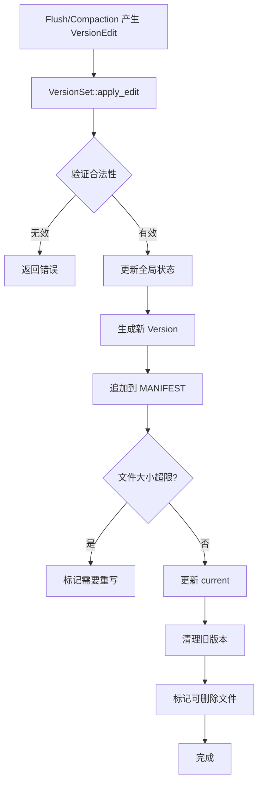

# VersionSet 设计方案

## 概述

VersionSet 是 GoatDB 的核心元数据管理组件，负责：
- 维护数据库当前状态的完整视图（Version）
- 应用增量变更（VersionEdit）
- 持久化 MANIFEST 文件
- 管理 SSTable 的生命周期
- 支持崩溃恢复

## 核心数据结构

### 1. Version - 数据库快照

```rust
/// 代表某一时刻数据库的完整状态
pub struct Version {
    /// 每层包含的 SSTable 文件元数据
    /// files[level] = Vec<FileMetaData>
    files: Vec<Vec<Arc<FileMetaData>>>,

    /// 用于快速查找的索引
    /// key -> (level, file_id) 映射，加速查找
    file_index: HashMap<Vec<u8>, Vec<(usize, u64)>>,

    /// 每层的总大小（用于触发压缩）
    level_size_bytes: Vec<u64>,

    /// 该版本创建时的序列号
    creation_seqno: u64,
}

impl Version {
    /// 查找包含指定 key 的 SSTable
    pub fn get(&self, key: &[u8]) -> Option<(usize, Arc<FileMetaData>)>;

    /// 获取指定层级的所有文件
    pub fn get_files(&self, level: usize) -> &[Arc<FileMetaData>];

    /// 计算层级总大小
    pub fn get_level_size(&self, level: usize) -> u64;

    /// 检查是否需要压缩
    pub fn needs_compaction(&self) -> bool;
}
```

**设计要点：**
- **不可变性**：Version 一旦创建不再修改，保证并发读取安全
- **多层级支持**：支持 Level 0-6，Level 0 文件可重叠，其他层不重叠
- **快速查找**：通过 file_index 索引加速查询
- **压缩决策**：基于层级大小触发自动压缩

### 2. VersionSet - 版本管理器

```rust
/// VersionSet 管理所有版本和增量变更
pub struct VersionSet {
    /// 当前活跃版本（读取操作的视图）
    current: Arc<Version>,

    /// 历史版本列表（用于旧读取操作和压缩）
    /// 保留最新 N 个版本
    versions: Vec<Arc<Version>>,

    /// 增量变更列表（用于重放）
    version_edits: Vec<VersionEdit>,

    /// MANIFEST 文件管理
    manifest_file: Option<ManifestWriter>,
    manifest_file_number: u64,

    /// 全局状态
    log_number: u64,
    next_file_number: u64,
    last_sequence: u64,
    comparator_name: String,

    /// SSTable 引用计数
    /// file_id -> count，用于判断文件是否可删除
    file_refs: HashMap<u64, usize>,

    /// 待删除的 SSTable 文件
    obsolete_files: Vec<FileMetaData>,

    /// 配置选项
    options: VersionSetOptions,
}

pub struct VersionSetOptions {
    /// 保留的历史版本数量
    pub max_versions: usize,

    /// MANIFEST 文件大小限制（超过则重写）
    pub manifest_max_size: u64,

    /// 触发 MANIFEST 重写的版本编辑数量
    pub manifest_rewrite_edit_count: u64,
}
```

**核心职责：**
1. **版本管理**：维护当前版本和历史版本
2. **变更应用**：接收 VersionEdit 并生成新版本
3. **持久化**：将变更写入 MANIFEST
4. **文件清理**：跟踪文件引用，清理无用文件
5. **压缩协调**：提供压缩所需的信息

### 3. ManifestWriter - MANIFEST 文件写入器

```rust
pub struct ManifestWriter {
    file: BufWriter<File>,
    file_number: u64,
    current_size: u64,
}

impl ManifestWriter {
    /// 追加一条 VersionEdit
    pub fn append_edit(&mut self, edit: &VersionEdit) -> Result<()> {
        let encoded = edit.encode_to_vec();
        let len = encoded.len() as u64;
        self.file.write_all(&len.to_be_bytes())?;
        self.file.write_all(&encoded)?;
        self.file.flush()?;
        self.current_size += len;
        Ok(())
    }

    /// 获取当前文件大小
    pub fn size(&self) -> u64 {
        self.current_size
    }
}
```

## VersionEdit 应用机制

### 应用流程



### 详细步骤

#### 1. 应用 VersionEdit

```rust
impl VersionSet {
    pub fn apply_edit(&mut self, edit: VersionEdit) -> Result<()> {
        // 1. 验证 VersionEdit 的合法性
        self.validate_edit(&edit)?;

        // 2. 更新全局状态
        if let Some(log_num) = edit.log_number {
            self.log_number = log_num;
        }
        if let Some(next_file) = edit.next_file_number {
            self.next_file_number = next_file;
        }
        if let Some(last_seq) = edit.last_sequence {
            self.last_sequence = last_seq;
        }

        // 3. 创建新 Version
        let new_version = self.create_new_version(&edit)?;

        // 4. 持久化到 MANIFEST
        self.append_to_manifest(&edit)?;

        // 5. 更新当前版本
        let old_version = std::mem::replace(&mut self.current, new_version);
        self.append_old_version(old_version);

        // 6. 清理和引用计数
        self.update_file_refs(&edit);
        self.mark_obsolete_files(&edit);

        // 7. 检查是否需要重写 MANIFEST
        if self.should_rewrite_manifest() {
            self.schedule_manifest_rewrite();
        }

        Ok(())
    }
}
```

#### 2. 创建新 Version

```rust
impl VersionSet {
    fn create_new_version(&self, edit: &VersionEdit) -> Result<Arc<Version>> {
        // 复制当前版本的所有文件
        let mut new_files = self.current.files.clone();

        // 应用删除的文件
        for (level, file_num) in &edit.deleted_files {
            if let Some(files) = new_files.get_mut(*level) {
                files.retain(|f| f.file_id != *file_num);
            }
        }

        // 应用新增的文件
        for (level, meta) in &edit.new_files {
            if new_files.len() <= *level {
                new_files.resize(*level + 1, Vec::new());
            }
            new_files[*level].push(Arc::new(meta.clone()));
        }

        // 对 Level 0 以外的层级排序（保证不重叠且有序）
        for level_files in new_files.iter_mut().skip(1) {
            level_files.sort_by_key(|f| &f.smallest_key);
        }

        // 构建索引
        let file_index = self.build_file_index(&new_files);

        // 计算层级大小
        let level_size_bytes = new_files.iter()
            .map(|files| files.iter().map(|f| f.file_size).sum())
            .collect();

        Ok(Arc::new(Version {
            files: new_files,
            file_index,
            level_size_bytes,
            creation_seqno: self.last_sequence,
        }))
    }
}
```

#### 3. 文件引用计数

```rust
impl VersionSet {
    fn update_file_refs(&mut self, edit: &VersionEdit) {
        // 增加新文件的引用
        for (level, meta) in &edit.new_files {
            *self.file_refs.entry(meta.file_id).or_insert(0) += 1;
        }

        // 减少删除文件的引用
        for (level, file_num) in &edit.deleted_files {
            if let Some(count) = self.file_refs.get_mut(file_num) {
                *count -= 1;
                if *count == 0 {
                    // 引用计数为 0，标记为可删除
                    self.obsolete_files.push(/* 文件信息 */);
                    self.file_refs.remove(file_num);
                }
            }
        }

        // 更新历史版本的引用计数
        self.cleanup_old_versions();
    }

    fn cleanup_old_versions(&mut self) {
        // 保留最新 max_versions 个版本
        while self.versions.len() > self.options.max_versions {
            let old = self.versions.remove(0);
            // 减少该版本中所有文件的引用计数
            for files in old.files.iter() {
                for file in files.iter() {
                    if let Some(count) = self.file_refs.get_mut(&file.file_id) {
                        *count -= 1;
                        if *count == 0 {
                            self.obsolete_files.push(file.as_ref().clone());
                            self.file_refs.remove(&file.file_id);
                        }
                    }
                }
            }
        }
    }
}
```

## SSTable 自动清理机制

### 清理策略

```rust
impl VersionSet {
    /// 后台清理任务，定期调用
    pub fn purge_obsolete_files(&mut self, path_manager: &DbPathManager) -> Result<()> {
        let mut deleted = Vec::new();

        for file_meta in &self.obsolete_files {
            let path = path_manager.sstable_path(
                /* 推断 level 和 file_num */
            );

            // 删除物理文件
            if let Err(e) = std::fs::remove_file(&path) {
                eprintln!("Failed to delete {}: {}", path.display(), e);
                continue;
            }

            deleted.push(file_meta.file_id);
        }

        // 从列表中移除已删除的文件
        self.obsolete_files.retain(|f| !deleted.contains(&f.file_id));

        // 清理旧的 MANIFEST 文件
        self.cleanup_old_manifests(path_manager)?;

        Ok(())
    }

    fn cleanup_old_manifests(&self, path_manager: &DbPathManager) -> Result<()> {
        // 保留最新的 MANIFEST 文件
        // 删除所有 .manifest-old 文件
        let manifest_dir = path_manager.manifest_dir();
        for entry in std::fs::read_dir(manifest_dir)? {
            let entry = entry?;
            let path = entry.path();

            if path.extension().and_then(|s| s.to_str()) == Some("old") {
                let _ = std::fs::remove_file(&path);
            }
        }
        Ok(())
    }
}
```

### 清理触发时机

1. **每次应用 VersionEdit 后**：检查是否有文件引用计数归零
2. **定期后台任务**：每 N 秒执行一次 `purge_obsolete_files`
3. **压缩完成时**：压缩后立即清理旧文件
4. **MANIFEST 重写后**：清理旧的 MANIFEST 文件

## MANIFEST 文件管理

### MANIFEST 格式

```
[Manifest Header]
- MAGIC_NUMBER (8 bytes)
- FORMAT_VERSION (4 bytes)

[Manifest Body] (重复 N 次)
- Record Length (8 bytes, big-endian)
- VersionEdit (varint encoded)

[Manifest Footer]
- Checksum (4 bytes)
```

### MANIFEST 重写机制

当 MANIFEST 文件过大时，需要重写：

```rust
impl VersionSet {
    fn rewrite_manifest(&mut self) -> Result<()> {
        // 1. 创建新的 MANIFEST 文件
        let new_manifest_num = self.next_file_number;
        self.next_file_number += 1;

        let new_path = self.path_manager.manifest_path(new_manifest_num);
        let mut new_writer = ManifestWriter::create(&new_path)?;

        // 2. 写入当前状态的快照
        let snapshot_edit = self.create_snapshot_edit();
        new_writer.append_edit(&snapshot_edit)?;

        // 3. 切换到新的 MANIFEST
        let old_writer = std::mem::replace(&mut self.manifest_file, Some(new_writer));
        self.manifest_file_number = new_manifest_num;

        // 4. 重命名旧 MANIFEST 为 .old
        if let Some(old) = old_writer {
            let old_path = self.path_manager.manifest_path(old.file_number);
            let backup_path = format!("{}.old", old_path);
            std::fs::rename(&old_path, &backup_path)?;
        }

        // 5. CURRENT 文件指向新的 MANIFEST
        self.update_current_file(new_manifest_num)?;

        Ok(())
    }

    /// 创建表示当前完整状态的 VersionEdit
    fn create_snapshot_edit(&self) -> VersionEdit {
        let mut edit = VersionEdit {
            log_number: Some(self.log_number),
            next_file_number: Some(self.next_file_number),
            last_sequence: Some(self.last_sequence),
            comparator_name: Some(self.comparator_name.clone()),
            ..Default::default()
        };

        // 添加所有现有文件
        for (level, files) in self.current.files.iter().enumerate() {
            for file in files.iter() {
                edit.new_files.push((level, file.as_ref().clone()));
            }
        }

        edit
    }
}
```

### CURRENT 文件

`CURRENT` 文件包含当前使用的 MANIFEST 文件名：

```
MANIFEST-00123
```

每次切换到新 MANIFEST 时原子性地更新此文件。

## 崩溃恢复流程

### 启动时恢复

```rust
impl VersionSet {
    pub fn recover(options: &KvEngineOptions) -> Result<Self> {
        let path_manager = DbPathManager::new(&options.data_dir);

        // 1. 读取 CURRENT 文件，获取最新的 MANIFEST
        let manifest_num = self.read_current_file(&path_manager)?;

        // 2. 读取并重放 MANIFEST 中的所有 VersionEdit
        let manifest_path = path_manager.manifest_path(manifest_num);
        let edits = self.read_manifest_edits(&manifest_path)?;

        // 3. 重放所有编辑，构建当前状态
        let mut version_set = Self::new_empty(options);
        for edit in edits {
            version_set.apply_edit_during_recovery(edit)?;
        }

        // 4. 验证恢复状态
        version_set.validate_recovery()?;

        // 5. 重新打开 MANIFEST 用于追加
        let manifest_file = std::fs::OpenOptions::new()
            .append(true)
            .open(&manifest_path)?;
        version_set.manifest_file = Some(ManifestWriter::from_file(manifest_file, manifest_num));

        Ok(version_set)
    }

    fn validate_recovery(&self) -> Result<()> {
        // 检查所有 SSTable 文件是否存在
        // 检查文件大小是否匹配
        // 检查 key 范围是否合法
        Ok(())
    }
}
```

### 恢复验证

1. **文件完整性**：检查所有记录的 SSTable 文件是否存在
2. **大小一致性**：验证文件实际大小与记录是否匹配
3. **Key 范围验证**：
   - Level 1-6: 同层级文件不应重叠
   - 每个文件的 smallest_key <= largest_key
4. **序列号单调性**：last_sequence 应该单调递增

## 与现有组件集成

### 1. Flush Worker 集成

```rust
// 在 flush_worker.rs 中

impl FlushWorker {
    fn flush_memtable(&mut self, memtable: ImmutableMemTable) -> Result<FileMetaData> {
        // 1. 构建 SSTable
        let (meta, reader) = self.build_sstable(memtable)?;

        // 2. 创建 VersionEdit
        let mut edit = VersionEdit::default();
        edit.new_files.push((0, meta.clone()));

        // 3. 应用到 VersionSet
        self.version_set.lock().unwrap().apply_edit(edit)?;

        Ok(meta)
    }
}
```

### 2. KvEngine 集成

```rust
// 在 kv_engine.rs 中

pub struct KvEngine {
    // ... 现有字段
    version_set: Arc<RwLock<VersionSet>>,
}

impl KvEngine {
    pub fn new(options: KvEngineOptions) -> Result<Self> {
        // 1. 恢复或创建 VersionSet
        let version_set = if options.recover_from_wal {
            VersionSet::recover(&options)?
        } else {
            VersionSet::new_empty(&options)
        };

        // 2. 启动后台任务
        let version_set = Arc::new(RwLock::new(version_set));
        self.spawn_background_tasks(version_set.clone());

        Ok(Self {
            version_set,
            // ...
        })
    }

    fn spawn_background_tasks(&self, version_set: Arc<RwLock<VersionSet>>) {
        // 文件清理任务
        tokio::spawn(async move {
            let mut interval = tokio::time::interval(Duration::from_secs(60));
            loop {
                interval.tick().await;
                let mut vs = version_set.write().await;
                let _ = vs.purge_obsolete_files(&self.path_manager);
            }
        });

        // 压缩任务（后续实现）
        // ...
    }
}
```

### 3. 读取路径集成

```rust
impl KvEngine {
    pub fn get(&self, key: &[u8]) -> Result<Option<Bytes>> {
        // 1. 读取当前版本
        let version = self.version_set.read().unwrap().current();

        // 2. 首先查找 MemTable
        if let Some(value) = self.memtable.get(key) {
            return Ok(value);
        }

        // 3. 按照 Version 的层级顺序查找 SSTable
        for level in 0..version.files.len() {
            if let Some((_, file)) = version.get(key) {
                let reader = self.sstable_cache.get(&file.file_id)?;
                if let Some(value) = reader.get(key)? {
                    return Ok(Some(value));
                }
            }
        }

        Ok(None)
    }
}
```

## 配置参数

### 推荐配置

```rust
impl Default for VersionSetOptions {
    fn default() -> Self {
        Self {
            // 保留 10 个历史版本
            // 足够支持后台压缩和旧读取操作
            max_versions: 10,

            // MANIFEST 超过 32MB 时重写
            // 平衡重写频率和启动恢复时间
            manifest_max_size: 32 * 1024 * 1024,

            // 或每 10000 次 VersionEdit 后重写
            manifest_rewrite_edit_count: 10000,
        }
    }
}
```

### 层级大小目标（为压缩做准备）

```rust
pub const LEVEL_TARGET_SIZE: [u64; 7] = [
    8 * 1024 * 1024,    // Level 0: 8MB (不强制)
    64 * 1024 * 1024,   // Level 1: 64MB
    512 * 1024 * 1024,  // Level 2: 512MB
    4 * 1024 * 1024 * 1024,    // Level 3: 4GB
    32 * 1024 * 1024 * 1024,   // Level 4: 32GB
    256 * 1024 * 1024 * 1024,  // Level 5: 256GB
    1024 * 1024 * 1024 * 1024, // Level 6: 1TB
];

pub const LEVEL_COMPACTION_TRIGGER: [usize; 7] = [
    4,   // Level 0: 文件数超过 4
    1,   // Level 1-6: 大小超过目标
    1,
    1,
    1,
    1,
    1,
];
```

## 实现优先级

### Phase 1: 核心功能
1. ✅ VersionEdit 结构和序列化（已完成）
2. ⬜ Version 结构实现
3. ⬜ VersionSet 基础实现
4. ⬜ MANIFEST 读写

### Phase 2: 集成
5. ⬜ Flush Worker 生成 VersionEdit
6. ⬜ KvEngine 集成 VersionSet
7. ⬜ 读取路径使用 Version

### Phase 3: 高级功能
8. ⬜ 崩溃恢复
9. ⬜ 文件清理
10. ⬜ MANIFEST 重写

### Phase 4: 压缩支持
11. ⬜ 多层级 SSTable 组织
12. ⬜ 压缩调度器（后续版本）

## 关键设计决策

### 1. 为什么使用不可变 Version？
- **并发安全**：读取操作无需加锁
- **一致性**：读取看到一致的快照视图
- **简化逻辑**：避免复杂的锁机制

### 2. 为什么需要文件引用计数？
- **安全删除**：确保没有旧版本引用文件
- **支持压缩**：压缩过程中引用旧文件
- **增量清理**：避免一次性大量删除

### 3. 为什么 MANIFEST 需要重写？
- **启动性能**：避免重放过多增量编辑
- **空间回收**：删除文件的编辑不再需要
- **简化恢复**：快照 + 少量增量

### 4. 为什么保留多个历史版本？
- **后台压缩**：压缩过程中需要旧版本
- **长读取**：长时间运行的读取需要一致视图
- **增量应用**：快速切换到新版本

## 测试策略

### 单元测试
- VersionEdit 序列化/反序列化
- Version 查找逻辑
- 引用计数更新
- 文件清理逻辑

### 集成测试
- Flush 产生 VersionEdit
- 完整应用流程
- MANIFEST 持久化
- 崩溃恢复

### 压力测试
- 高并发 VersionEdit 应用
- 大量版本切换
- MANIFEST 重写性能
- 文件清理效率

## 性能考虑

### 内存优化
- Version 使用 Arc 共享 FileMetaData
- 限制历史版本数量
- 文件索引使用 HashMap 加速查找

### 磁盘优化
- MANIFEST 批量 flush
- Varint 编码减少空间
- 异步删除旧文件

### 并发优化
- 读取无锁（不可变 Version）
- 写入使用 RwLock
- 后台任务异步执行

## 未来扩展

1. **压缩调度器**：基于 Version 信息调度压缩
2. **统计信息**：每个文件的读取/写入统计
3. **布隆过滤器**：集成到 FileMetaData
4. **快照功能**：支持用户创建时间点快照
5. **增量备份**：基于 VersionEdit 的增量备份
